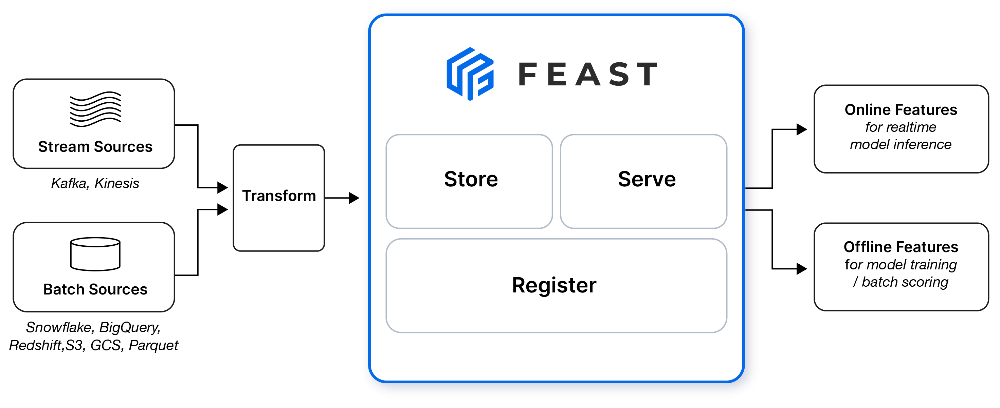

# Feature Store Module

This module handles data ingestion, preprocessing, and feature engineering for the ML pipeline.

## Overview

The feature store module is responsible for:
- Loading and preprocessing raw data
- Creating train/validation/test splits
- Feature engineering and transformations
- Data validation and quality checks
- Storing processed features for training and inference

## Workflow

### 1. Initial Data Generation
```bash
python src/feature_store/generate_initial_data.py
```

**Purpose**: Creates the initial dataset for the ML pipeline.
- Downloads or generates raw data
- Performs basic data validation
- Saves raw data to the feature store

### 2. Data Preprocessing and Splitting
```bash
python src/training/split_data.py
```

**Purpose**: Prepares data for training by creating proper splits.
- Loads raw data from feature store
- Applies initial preprocessing (cleaning, type conversion)
- Creates stratified train/validation/test splits
- Saves splits as parquet files in `DATA_DIR`

**Output Files**:
- `train_set.parquet` - Training data (70%)
- `valid_set.parquet` - Validation data (15%)
- `test_set.parquet` - Test data (15%)

### 3. Feature Engineering Pipeline
The feature engineering happens during training via `TrainingDataPrep` class:

```python
from src.feature_store.utils.data import TrainingDataPrep

data_prep = TrainingDataPrep(...)
pipeline = data_prep.create_data_transformation_pipeline(...)
```

**Features**:
- Numerical feature scaling (StandardScaler, RobustScaler, MinMaxScaler)
- Categorical feature encoding (OneHotEncoder)
- Missing value imputation
- Feature selection (VarianceThreshold)

## Directory Structure

```
feature_store/
├── README.md                 # This file
├── generate_initial_data.py  # Initial data generation
├── prep_data.py             # Data preprocessing utilities
├── feature_repo/            # Feast feature store configuration
│   ├── feature_store.yaml   # Feast configuration
│   ├── define_feature.py    # Feature definitions
│   └── data/               # Raw data storage
└── utils/                   # Utility modules
    ├── __init__.py
    ├── config.py           # Feature store configuration
    ├── data.py             # Main data preprocessing classes
    └── prep.py             # Data preparation utilities
```

## Key Classes

### `TrainingDataPrep` (utils/data.py)
Main class for data preprocessing and feature engineering.

**Key Methods**:
- `load_data()` - Load data splits from parquet files
- `create_data_transformation_pipeline()` - Create sklearn pipeline for feature engineering
- `get_feature_names()` - Get processed feature names after transformation

---

## Using Feast for Feature Store

Feature store is a centralized place to store and serve features for machine learning. [Feast](https://feast.dev/), an open source feature store for machine learning, is used in this project to manage and serve features consistently across offline training and online inference environments.

Feast can handle the ingestion of feature data from both batch and streaming sources. It also manages both warehouse and serving databases for historical and the latest data.

<figure>

</figure>

Source: [Feast](https://feast.dev/)


## Data Transformation

Data transformation (preprocessing and feature engineering) is applied before ingesting it by the feature store as Feast does not support transformations natively and also to have consistent feature values across training and serving. The data preparation script (prep_data.py) transforms data into fresh features and target that are stored in local path (preprocessed_dataset_features.parquet and preprocessed_dataset_target.parquet). Note that raw and transformed data can be sourced and stored in a database that is compatible with Feast (see [Feast Data Sources](https://docs.feast.dev/reference/data-sources)). These files are then ingested by feature store and served for training or inference. Any changes needed for data preprocessing or transformation should be applied in prep_data.py script and prep.py utility module and then the feature definition can be changed in define_feature.py.

## Feature Store Setup

The feature store setup consists of the following steps:

- Define feature definitions in Python files under the `feature_repo` directory. Each feature definition specifies the name, data type, description, and source of the feature.

- Apply the feature definitions to the feature store using the `make init_feast` command. This command registers feature definition and create storage infrastructure (online_store.db in this project). Running this command returns the following ouput:

        Created entity patient
        Created feature view features_view
        Created feature view target_view

        Created sqlite table feature_store_features_view
        Created sqlite table feature_store_target_view

- The list of entities in the feature store registry can be shown using `make show_feast_entities`, which returns the following ouput:

        NAME     DESCRIPTION    TYPE
        patient  Patient ID     ValueType.STRING

- The views created in the feature store registry can be shown using `make show_feast_views`. The output should be:

        NAME           ENTITIES     TYPE
        features_view  {'patient'}  FeatureView
        target_view    {'patient'}  FeatureView

- The feature store can be explored using the web UI (experimental) by running the `make show_feast_ui` command. This will launch a browser window that shows the list of features, their statistics, and lineage.

- Build training datasets by specifying the features and entities of interest, and the time range and point-in-time correctness of the data. This can be done using the `get_historical_features` or `get_online_features` methods of the `FeatureStore` class in Python SDK.

- Existing feature store registry can be deleted by running the `make teardown_feast`.

Finally, to setup the feature store in one command, run the following command `make setup_feast`.
